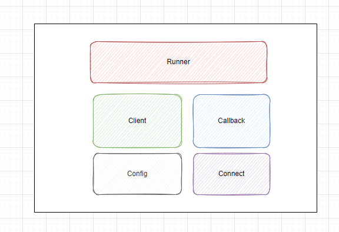

# bench-mqtt

## 1. bench-mqtt 结构

- Runner: 负责与 Spring 集成，基于 ApplicationRunner
- Client: 负责实现 Mqtt 客户端，提供可用的 Mqtt 客户端
- Callback: 负责 Mqtt 一系列回调的实现
- Config: 负责管理 Mqtt 连接必要的配置信息 
- Connect: 负责 Mqtt 客户端的连接和断线后的重连

## 2. 快速使用
### 2.1 引入依赖
```xml
<dependency>
    <groupId>com.bench.mqtt</groupId>
    <artifactId>bench-mqtt</artifactId>
</dependency>
```

### 2.2 连接配置
bench-mqtt 组件涉及的配置
```properties
# Felo 开放平台配置信息，用于获取 mqtt 连接信息（用户名密码等）
felosvr.appId=xxx
felosvr.appSecret=xxx
felosvr.feloSvrUrl=xxx

# mqtt client 类型 （可选）
# ASYNC: 表示使用 异步的 MQTTAsyncClient
# DEFAULT: 默认使用 MQTTClient
mqtt.client=ASYNC

# 默认重试实现的重试时间间隔（可选）
# 默认值为 1000 毫秒
mqtt.retry.interval=1000
```

### 2.3 自动连接
引入依赖后，bench-mqtt 组件会通过 `ApplicationRunner` 自动连接。可以通过配置选择使用的 `MqttClient`
```properties
# ASYNC: 表示使用 异步的 MQTTAsyncClient
# DEFAULT: 默认使用 MQTTClient
mqtt.client=ASYNC
```

### 2.4 注入使用
```java
// 使用默认的MqttClient
@Resource
private IMqttClient mqttClient;

// 使用异步的MqttClient
@Resource
private IMqttAsyncClient mqttClient;
```

### 2.5 自定义回调（可选）
bench-mqtt 中实现了默认的回调。如果需要自定义回调，需要实现对应的接口。`MQTTCallback` 或者 `MQTTAsyncCallback`

```java
@Component
@Primary
public class MyMqttCallback implements MqttCallback {
    //...
}
```
### 2.6 自定义重试（可选）
bench-mqtt 中实现了默认的重试机制。如果需要自定义重试实现机制，需要实现对应的接口`Reconnector`
 ```java
@Component
@Primary
public class MyReconnector implements Reconnector {
    //...
}
```

### 2.7 自定义 mqtt 连接信息获取（可选）
bench-mqtt 中实现了默认的 Mqtt 连接信息获取机制。如果需要自定义 Mqtt 连接信息获取机制，需要实现对应的接口。
 ```java
@Component
@Primary
public class MyMqttInfoGenerator implements MQTTConfigGenerator {
    //...
}
```


